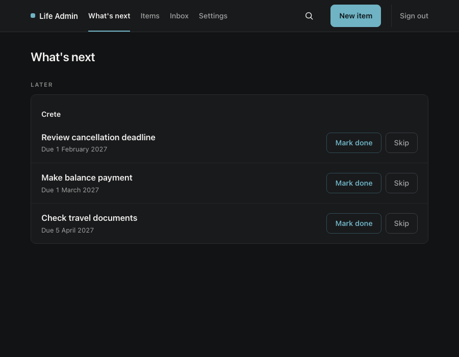
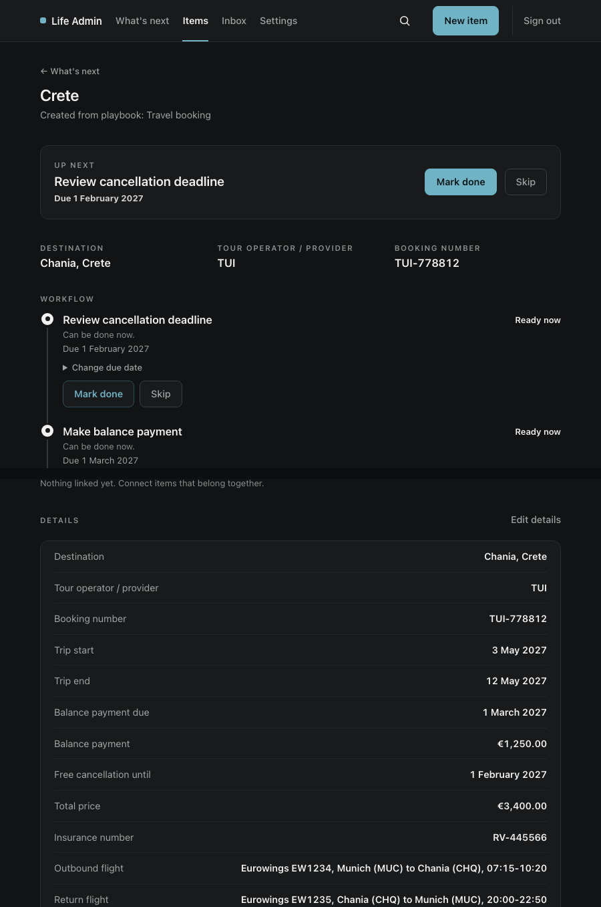
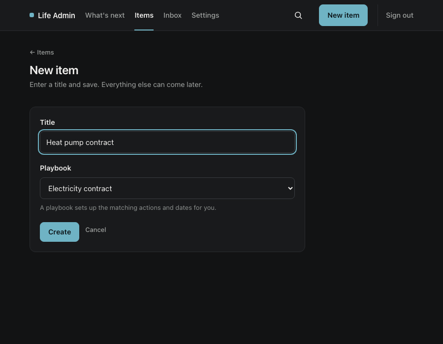

# Life Admin

Self-hosted app that tracks the recurring administrative stuff you can't
afford to forget: vehicle inspections, leasing and electricity contracts,
certificates, expiring documents. For anyone who wants this on their own
server, not in someone else's cloud.

**Status:** beta, active development. **License:** source-available, free
for non-commercial use ([details below](#license)). **Contributing:** see
[CONTRIBUTING.md](CONTRIBUTING.md).

## Screenshots





All data shown is fictional test data, not a real booking or contract.

## Contents

- [Quickstart](#quickstart)
- [Features](#features)
- [Key concepts](#key-concepts)
- [Also useful beyond the household](#also-useful-beyond-the-household)
- [Configuration](#configuration)
- [Backup and restore](#backup-and-restore)
- [Security](#security)
- [Support](#support)
- [Releases](#releases)
- [Local development](#local-development)
- [License](#license)

## Quickstart

```bash
docker compose up -d
```

Requires Docker and Docker Compose. One container, port 3000, all data in
a named volume. Open `http://localhost:3000` and create the Owner
account: the first person to reach the service claims it, so don't leave
it open on a public network before that.

**The one thing that trips people up:** if you access Life Admin at
anything other than `http://localhost:3000` (a LAN IP, a custom
hostname, a different port, a reverse proxy), you must set `ORIGIN` in
`compose.yaml` to match exactly, or every form submission fails with
"Cross-site POST form submissions are forbidden." See
[Configuration](#configuration).

## Features

- Items with recommended fields, dates, and actions, driven by Playbooks
- Bundled Playbooks: vehicle inspection (TÜV), electricity contract,
  leasing, non-assessment certificate, home maintenance, travel booking
- Custom Playbooks, paste or upload your own YAML
- Recurring Cycles with read-only history of past cycles
- Document attachments (PDF, JPEG, PNG, WebP)
- Inbox: upload first, decide which Item it belongs to later
- Global search across Items
- Related Items and an Item overview page
- Human-readable change history per Item
- Backup and restore as a single ZIP archive
- Optional AI-assisted document field extraction (off by default)
- Optional notifications via ntfy or Slack (off by default)

## Key concepts

- **Item**: the thing you're tracking. Example: "NV-Bescheinigung Max",
  "Electricity House", "Mallorca Trip".
- **Playbook**: a YAML file describing an Item's recommended fields,
  dates ("Events"), and actions with relative due dates ("2 months
  before certificate expiry"). Creating an Item from a Playbook freezes
  that Playbook into the Item: later Playbook edits never touch existing
  Items. Only the title is required; everything else can wait.

Every action belongs to an Item. There's no flat, anonymous to-do list.

## Also useful beyond the household

The examples above are private households, but Items and Playbooks fit
anyone tracking recurring deadlines tied to a specific thing:

- **Landlords**: one Item per rental unit, tracking lease renewal dates,
  deposit deadlines, mandatory safety inspections, and insurance renewals.
- **Tradespeople**: one Item per client job or company vehicle, tracking
  warranty periods, follow-up visits, vehicle inspections, and
  certification renewals.
- **Small businesses**: one Item per contract, licence, or piece of
  equipment that needs periodic renewal or inspection.

None of this needs a bundled Playbook: write a [custom
one](#custom-playbooks), or start with a generic Item and add fields and
actions as you go.

## Configuration

### Access and HTTPS

Plain HTTP sends the password and session cookie unencrypted, so only
use it on a trusted home network. For HTTPS, put a reverse proxy in
front and set `ORIGIN`, `PROTOCOL_HEADER=x-forwarded-proto`, and
`HOST_HEADER=x-forwarded-host`; the Secure cookie flag turns on by
itself (`LIFEADMIN_COOKIE_SECURE` can override it).

Forgot the password? Set `LIFEADMIN_RESET_OWNER_PASSWORD`, restart, sign
in, then remove the variable and restart again.

### Bundled playbooks

| Id                          | What it tracks                            |
| --------------------------- | ----------------------------------------- |
| `de.vehicle.tuv`            | vehicle inspection (TÜV)                  |
| `de.finance.nv-certificate` | non-assessment certificate                |
| `de.contract.electricity`   | electricity contract                      |
| `de.vehicle.leasing`        | vehicle leasing contract                  |
| `de.home.maintenance`       | recurring maintenance or inspection       |
| `de.travel.booking`         | dates, payments, and deadlines for a trip |

### Custom playbooks

Add one under Settings, Playbooks: paste YAML or upload a `.yaml` file.
It's validated before storing, then available for new Items right away.
Replacing or removing a Playbook never touches existing Items.

See ["Authoring Playbooks" in CONTRIBUTING.md](CONTRIBUTING.md#authoring-playbooks)
for the schema, the validation command, and a worked example. Advanced
users can also drop `.yaml` files under `/data/playbooks` in the
container volume; invalid files are skipped and reported in Settings.

### Attachments and Inbox

Attach documents to Items directly (PDF, JPEG, PNG, WebP, up to 10 MB
each), stored under `/data/attachments` and included in backups. Or
upload to the Inbox first and route it to an existing or new Item later;
Inbox documents stay private and are included in backups until routed
or deleted.

### AI document extraction (optional)

Off by default. Needs an OpenAI API key and an explicit consent toggle
in `/settings`. Once on, attachments get an "Informationen erkennen"
button that returns a reviewable list of suggested field values;
nothing writes to the Item until you pick a value and submit.

```
LIFEADMIN_OPENAI_API_KEY=sk-...
# LIFEADMIN_AI_MODEL=gpt-5.6-terra   # operator override only, see .env.example
```

Under Docker Compose, copy `.env.example` to `.env`, fill in the key,
uncomment `env_file: .env` in `compose.yaml`, then `docker compose up -d`
again (`compose.yaml` ignores `.env.example` itself).

Only the selected document's bytes, its MIME type, and the current
cycle's field labels get sent, never the title, notes, other
attachments, or existing values. The key never touches the database or
a backup; a restored backup on a new machine needs the env var set
again, same as `ORIGIN`.

### Notifications (optional)

Off by default. Pick one channel in Settings: an ntfy server/topic or a
Slack Incoming Webhook. One reminder shortly before something is due,
one when it's overdue. Nothing goes out for undated, blocked, completed,
archived, or unresolved work. Tokens stay local and are excluded from
backups, so re-enter them after restoring elsewhere.

## Backup and restore

Download a ZIP backup from Settings: all your private data, including
attachments, capped at 256 MiB compressed. Restore validates the archive
and takes a safety copy first. Afterward, run
`docker compose restart lifeadmin`.

For a full volume copy, stop the service, run
`docker cp lifeadmin:/data ./backup`, then start it again. Pre-restore
safety copies can be pulled without stopping:
`docker cp lifeadmin:/data/backups ./`.

## Security

- Self-hosted: your data never leaves your server unless you turn on
  optional AI extraction or notifications, and even then only the
  specific document or reminder text goes out, never your full database.
- Backups exclude stored secrets (AI provider keys, notification
  tokens) by design.
- Plain HTTP is unencrypted in transit; use it only on a trusted network,
  or put HTTPS in front (see [Configuration](#configuration)).
- No telemetry, no analytics, no phoning home.
- Found a vulnerability? Use GitHub's private vulnerability reporting for
  this repository instead of a public issue. See [SECURITY.md](SECURITY.md).

## Support

- Bug or question: open a GitHub issue.
- Security vulnerability: see [SECURITY.md](SECURITY.md), don't use a
  public issue.
- Something not working after setup: check
  [Access and HTTPS](#access-and-https) for the `ORIGIN` pitfall first,
  it's the most common cause of failed form submissions.

## Releases

Life Admin follows a build-once, promote-after-validation release process.
Release candidates are deployed to a private staging environment and validated
before the exact same artifact is promoted to an official GHCR image and
GitHub Release.

See [docs/releasing.md](docs/releasing.md) for the full release runbook,
quality gates, and versioning details.

## Local development

Requires Node.js 24.

```bash
npm install
npm run dev
```

```bash
npm run verify   # lint, typecheck, playbook validation, unit tests, build
npm run test:e2e # Playwright end-to-end tests (builds first)
```

See [CONTRIBUTING.md](CONTRIBUTING.md) for the full workflow.

## License

Source-available. Free to use, modify, and self-host under the PolyForm
Noncommercial License 1.0.0. Commercial use needs a separate commercial
license.

- [`LICENSE`](LICENSE)
- [`COMMERCIAL-LICENSE.md`](COMMERCIAL-LICENSE.md)
